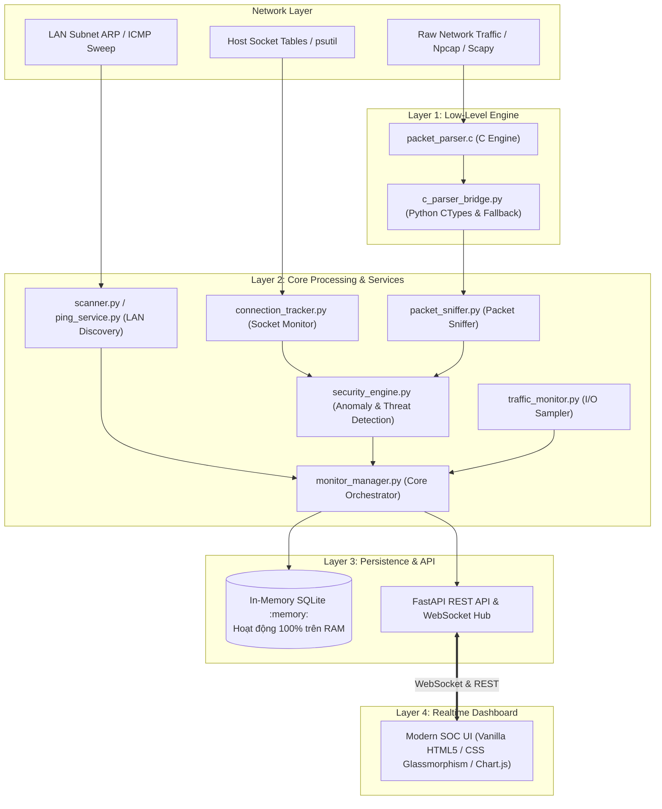

# Network Security Monitor - Architecture Map & Development Roadmap

Tài liệu này cung cấp toàn cảnh kiến trúc mã nguồn (Source Map), luồng dữ liệu thời gian thực (Data Flow Pipeline) và lộ trình phát triển kỹ thuật (Roadmap V1 ➔ V4) cho hệ thống **Network Security Monitor**.

---

## 1. Kiến Trúc Tổng Thể Hệ Thống (System Overview)

Hệ thống được thiết kế theo mô hình **Multi-Tier SOC Engine**, kết hợp giữa tốc độ phân tích cấp thấp của **C (Low-Level Packet Engine)**, khả năng điều phối bất đồng bộ của **Python AsyncIO / FastAPI**, cơ chế lưu trữ tối ưu của **SQLite WAL**, và giao diện thời gian thực **Vanilla Web (HTML5/CSS3/Chart.js)** không phụ thuộc build tool nặng nề.



---

## 2. Bản Đồ Cấu Trúc Mã Nguồn (Codebase Directory & Module Map)

```
network-monitor/
├── backend/                       # Toàn bộ mã nguồn phía máy chủ
│   ├── api/                       # Các API Router (FastAPI)
│   │   ├── connections.py         # REST: Xem danh sách các kết nối active / lịch sử socket
│   │   ├── devices.py             # REST: Quản lý thiết bị LAN, đặt tên, chỉnh loại thiết bị
│   │   ├── events.py              # REST: Lịch sử sự kiện phát hiện thiết bị
│   │   ├── network.py             # REST: Thông tin cấu hình mạng (IP, Subnet, Gateway, Interface)
│   │   ├── packets.py             # REST: Danh sách gói tin phân tích & thống kê giao thức
│   │   ├── security.py            # REST: Nhật ký cảnh báo bảo mật (ARP spoof, port độc hại)
│   │   ├── stats.py               # REST: Thống kê tổng hợp (Uptime, online/offline, traffic)
│   │   └── websocket.py           # WebSocket: Điểm kết nối truyền phát dữ liệu thời gian thực
│   │
│   ├── c_modules/                 # Module C phân tích gói tin cấp thấp (Low-Level C Module)
│   │   ├── packet_parser.c        # Mã C bóc tách header Ethernet/IPv4/TCP/UDP/ICMP/ARP
│   │   ├── packet_parser.h        # Khai báo cấu trúc dữ liệu C Struct
│   │   ├── build_c.py             # Script tự động tìm compiler (gcc/clang/cl) để biên dịch .dll/.so
│   │   └── c_parser_bridge.py     # Cầu nối CTypes nạp C Module + Giả lập thuần Python nếu thiếu C compiler
│   │
│   ├── memory_store.py            # Bộ nhớ tạm thuần Python RAM (Dict & Deque) - Tắt là quên sạch
│   ├── services/                  # Nghiệp vụ giám sát mạng & bảo mật
│   │   ├── connection_tracker.py  # Giám sát TCP/UDP sockets, phát hiện kết nối cổng bất thường
│   │   ├── monitor_manager.py     # Điều phối viên trung tâm: quản lý vòng lặp nền & WebSocket
│   │   ├── network_info.py        # Tự động nhận diện Card mạng, IP nội bộ, Netmask, Gateway
│   │   ├── packet_sniffer.py      # Bắt gói tin, gửi qua C Parser và cập nhật thống kê
│   │   ├── ping_service.py        # Ping ICMP không đồng bộ + Đọc bảng ARP hệ thống
│   │   ├── scanner.py             # Dò quét dải IP, phát hiện thiết bị và quét nhanh các cổng mở
│   │   ├── security_engine.py     # Động cơ phát hiện bất thường: ARP Spoofing, Cổng độc hại
│   │   ├── traffic_monitor.py     # Đo tốc độ Download/Upload theo thời gian thực
│   │   ├── vendor_lookup.py       # Tra cứu hãng sản xuất theo địa chỉ MAC (OUI Database)
│   │   └── websocket_manager.py   # Quản lý danh sách client WebSocket kết nối vào hệ thống
│   │
│   ├── config.py                  # Cấu hình mặc định tối ưu (không cần file .env)
│   ├── logging_config.py          # Cấu hình log console (không tạo file log rác ra đĩa)
│   └── main.py                    # Khởi tạo FastAPI App, CORS, Lifespan và mount Static Files
│
├── frontend/                      # Giao diện người dùng thời gian thực (Vanilla Web)
│   ├── css/
│   │   └── style.css              # Giao diện Glassmorphism Dark Mode cao cấp
│   ├── js/
│   │   └── app.js                 # Xử lý WebSocket, cập nhật DOM tức thời, biểu đồ Chart.js
│   └── index.html                 # Trang tổng quan điều hành an ninh mạng (SOC Dashboard)
│
├── docs/                          # Tài liệu kỹ thuật và giáo trình đào tạo
│   ├── NETWORK_SECURITY_CURRICULUM.md # Giáo trình lý thuyết & thực hành an ninh mạng
│   └── ARCHITECTURE_ROADMAP.md        # Bản đồ kiến trúc & lộ trình phát triển hệ thống
│
├── .gitignore                     # Bỏ qua file rác, cache và dữ liệu nhạy cảm
├── README.md                      # Hướng dẫn cài đặt và tổng quan dự án (Zero-Footprint)
├── requirements.txt               # Danh sách thư viện Python cần thiết tối giản
├── run.py                         # Trình khởi động thông minh 1-Click (In-Memory Launcher)
└── start.bat                      # File khởi động nhanh trên hệ điều hành Windows
```

---

## 3. Luồng Dữ Liệu Thời Gian Thực (Data Flow Pipelines)

### 3.1. Luồng Dò Quét Thiết Bị LAN (LAN Discovery Pipeline)
1. `monitor_manager` kích hoạt chu kỳ quét (mặc định 30 giây).
2. `scanner.py` sử dụng `ping_service.py` gửi ping đồng thời tới toàn bộ IP trong dải subnet.
3. Các thiết bị phản hồi sẽ ghi nhận địa chỉ MAC vào bảng ARP của hệ điều hành.
4. `scanner.py` đọc bảng ARP, trích xuất ánh xạ `IP ➔ MAC`.
5. `vendor_lookup.py` tra cứu OUI để gán tên nhà sản xuất (Apple, Samsung, Intel, TP-Link...).
6. Quét nhanh các cổng phổ biến (Top 10 Ports: 80, 443, 22, 445, 3389, ...).
7. `security_engine.py` kiểm tra:
   - Phát hiện thiết bị mới trong mạng.
   - Phát hiện xung đột MAC/IP (Dấu hiệu ARP Poisoning / ARP Spoofing).
   - Phát hiện thiết bị mở cổng dịch vụ nguy hiểm (Telnet 23, SMB 445, RDP 3389).
8. Cập nhật vào SQLite và phát bản tin `devices_update` qua WebSocket tới Dashboard.

### 3.2. Luồng Bóc Tách Gói Tin C-Engine (Packet Inspection Pipeline)
1. Gói tin mạng được thu thập qua Scapy/Npcap hoặc luồng kiểm thử mẫu.
2. `packet_sniffer.py` chuyển chuỗi byte thô sang hàm `parse_packet()` trong `c_modules/packet_parser.c` (thông qua CTypes bridge).
3. Module C thực hiện:
   - Giải mã Ethernet Header (`src_mac`, `dst_mac`, `ethertype`).
   - Giải mã IP Header (`src_ip`, `dst_ip`, `ttl`, `protocol`).
   - Giải mã TCP/UDP Header (`src_port`, `dst_port`, `tcp_flags: SYN/ACK/FIN/RST/PSH/URG`).
   - Kiểm tra sơ bộ các mẫu bất thường (ví dụ: cờ TCP SYN+FIN hoặc kết nối cổng mã độc).
4. Kết quả bóc tách được trả về dạng từ điển Python trong thời gian dưới 1 miligiây.
5. Thống kê gói tin được cập nhật và phát trực tiếp tới bảng *Live Packet Sniffer* trên giao diện.

### 3.3. Luồng Theo Dõi Socket Hệ Thống (Socket Tracking Pipeline)
1. `connection_tracker.py` định kỳ lấy danh sách kết nối mạng từ kernel bằng `psutil.net_connections()`.
2. Lọc bỏ các kết nối loopback nội bộ (`127.0.0.1`).
3. So khớp cổng đích với danh sách cổng đen (`suspicious_ports`: 445, 3389, 4444, 6667...).
4. Trích xuất tên tiến trình sở hữu socket (`process_name`, `pid`).
5. **Cơ chế tối ưu hóa bộ nhớ & lưu trữ**:
   - Mọi socket active được đẩy realtime lên WebSocket để hiển thị tức thì trên dashboard.
   - Chỉ lưu trữ bền vững vào SQLite các kết nối có cờ nguy hiểm (`is_suspicious == 1`) hoặc mẫu đại diện định kỳ.
   - Tự động dọn dẹp các bản ghi cũ (`clear_old`), giữ cơ sở dữ liệu luôn nhẹ nhàng, phản hồi nhanh.

---

## 4. Lộ Trình Phát Triển Kỹ Thuật (Milestone Roadmap)

| Phiên Bản | Giai Đoạn | Trạng Thái | Tính Năng & Mục Tiêu Kỹ Thuật |
| :--- | :--- | :---: | :--- |
| **V1.0** | **Production Baseline** | **Hoàn Thành** | - Quét thiết bị LAN, nhận diện IP/MAC/Vendor/Hostname/Latency.<br>- Module C bóc tách gói tin (Packet Parser) với Python Fallback.<br>- Phát hiện ARP Spoofing và cảnh báo cổng nguy hiểm.<br>- Giám sát Socket & Process (PID, Port, Threat check).<br>- Giám sát băng thông với biểu đồ đường Chart.js siêu mượt.<br>- Dashboard Vanilla Glassmorphism Dark Mode. |
| **V2.0** | **Intrusion Detection (IDS)** | *Kế Hoạch Tiếp Theo* | - **Signature Engine**: Hỗ trợ nạp tập luật kiểm tra xâm nhập định dạng tương thích Snort/Suricata.<br>- **DNS Tunneling Detection**: Phân tích độ dài truy vấn DNS và độ hỗn loạn (Entropy) của tên miền để phát hiện rò rỉ dữ liệu.<br>- **SYN Flood & Port Sweep Detection**: Đếm tần suất cờ SYN trên từng IP nguồn để phát hiện hành vi quét mạng Nmap/Masscan. |
| **V3.0** | **Active Defense & Mitigation** | *Dự Kiến* | - **Tường lửa phản ứng (Dynamic Firewall)**: Tự động gọi API `netsh advfirewall` trên Windows hoặc `iptables` trên Linux để cô lập IP tấn công.<br>- **LAN Deception / Honeypot Trap**: Mở cổng ảo (Virtual Honeypot) để bẫy kẻ xâm nhập khi họ thực hiện rà quét trong mạng nội bộ.<br>- **Email & Telegram Webhook**: Gửi tin nhắn cảnh báo tức thì khi có sự cố an ninh nghiêm trọng. |
| **V4.0** | **Enterprise SOC & Multi-Probe** | *Dự Kiến* | - **PCAP Export**: Cho phép tải xuống file `.pcap` của các gói tin khả nghi để mở trực tiếp trong Wireshark.<br>- **SIEM Forwarding**: Đẩy log chuẩn RFC 5424 Syslog về Wazuh, Splunk, Elastic SIEM.<br>- **Distributed Probes**: Hỗ trợ triển khai nhiều cảm biến (Raspberry Pi/Mini PC) đặt tại các VLAN khác nhau và báo cáo về một Dashboard trung tâm. |

---

## 5. Hướng Dẫn Vận Hành & Khởi Động

### Khởi động nhanh (Windows)
Chỉ cần nhấp đúp chuột vào file:
```bat
start.bat
```
Hoặc chạy lệnh qua Terminal/Command Prompt:
```bash
python run.py
```
Hệ thống sẽ tự động:
1. Kiểm tra môi trường Python và cài đặt các thư viện còn thiếu (`fastapi`, `uvicorn`, `websockets`, `psutil`, `scapy`, `netifaces`, `python-dotenv`).
2. Tự động sao chép file `.env.example` thành `.env` nếu chưa có.
3. Khởi tạo cơ sở dữ liệu SQLite sạch sẽ và các dịch vụ nền.
4. Tự động mở trình duyệt web điều hướng tới `http://localhost:8000`.
